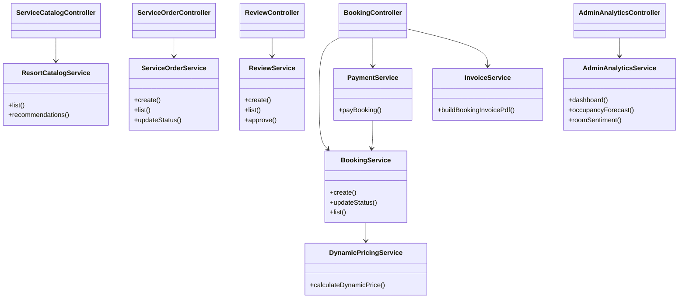

# Діаграма класів (спрощена, шар application + web)

Фокус: доменні сутності, ключові сервіси та REST-контролери.

Для повної UML у дипломі можна додати окремі пакети `domain.entity`, `domain.repository`, `infrastructure.security`.
