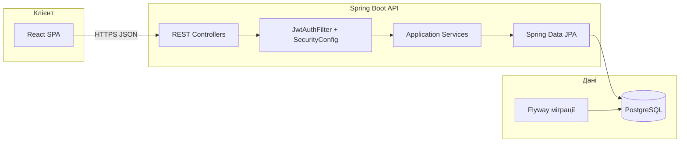

# Компонентна діаграма розгортання

**Пояснення для записки:** SPA спілкується лише з REST API; автентифікація станless (JWT); схема БД версіонується Flyway; чутливі операції захищені RBAC на рівні `SecurityConfig`.
