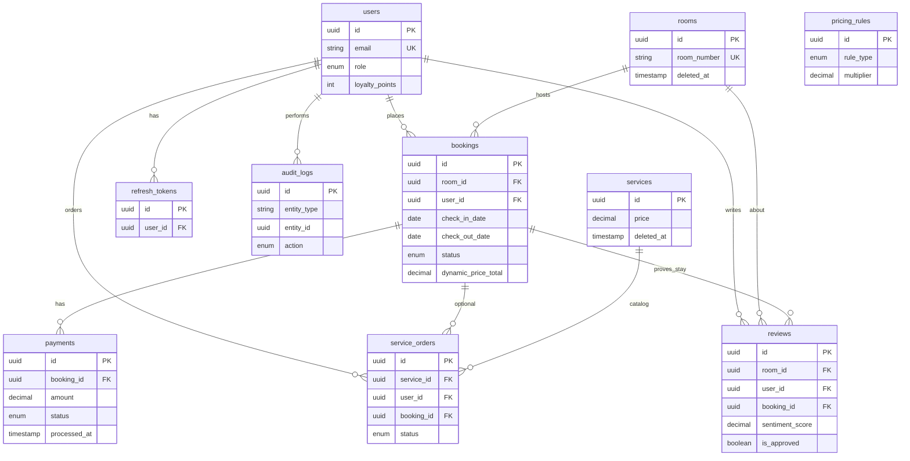

# ER-діаграма (логічна модель PostgreSQL)

Відповідає міграції `V1__init.sql` (11 основних таблиць + refresh_tokens).

```mermaid
erDiagram
    users ||--o{ bookings : places
    users ||--o{ service_orders : orders
    users ||--o{ reviews : writes
    users ||--o{ refresh_tokens : has
    users ||--o{ audit_logs : performs

    rooms ||--o{ bookings : hosts
    rooms ||--o{ reviews : about

    bookings ||--o{ payments : has
    bookings ||--o{ service_orders : optional
    bookings ||--o{ reviews : proves_stay

    services ||--o{ service_orders : catalog

    users {
        uuid id PK
        string email UK
        enum role
        int loyalty_points
    }

    rooms {
        uuid id PK
        string room_number UK
        timestamp deleted_at
    }

    bookings {
        uuid id PK
        uuid room_id FK
        uuid user_id FK
        date check_in_date
        date check_out_date
        enum status
        decimal dynamic_price_total
    }

    payments {
        uuid id PK
        uuid booking_id FK
        decimal amount
        enum status
        timestamp processed_at
    }

    services {
        uuid id PK
        decimal price
        timestamp deleted_at
    }

    service_orders {
        uuid id PK
        uuid service_id FK
        uuid user_id FK
        uuid booking_id FK
        enum status
    }

    reviews {
        uuid id PK
        uuid room_id FK
        uuid user_id FK
        uuid booking_id FK
        decimal sentiment_score
        boolean is_approved
    }

    pricing_rules {
        uuid id PK
        enum rule_type
        decimal multiplier
    }

    audit_logs {
        uuid id PK
        string entity_type
        uuid entity_id
        enum action
    }

    refresh_tokens {
        uuid id PK
        uuid user_id FK
    }
```
