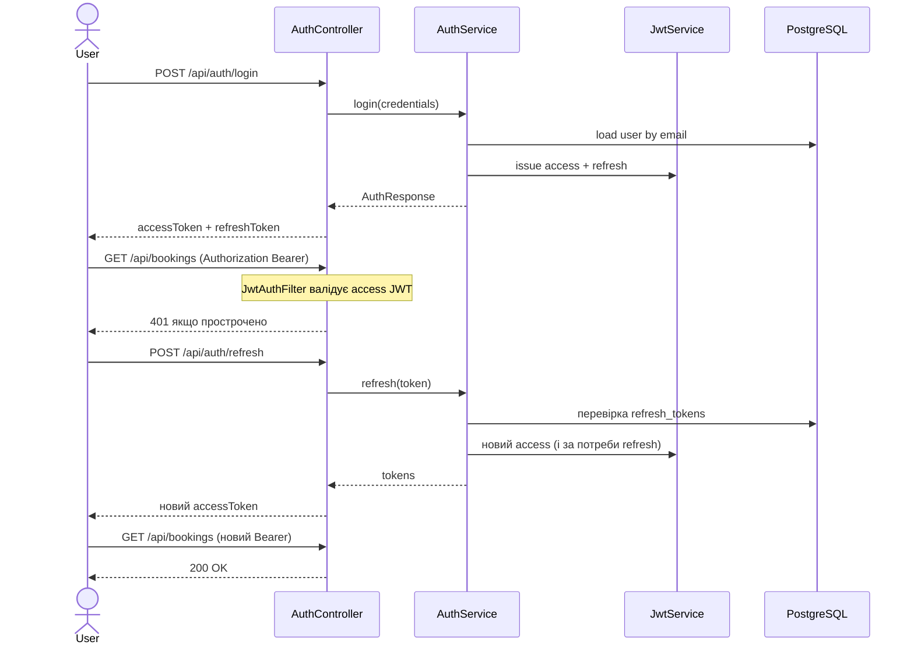

# Послідовність: логін → JWT → 401 → refresh → повтор

```mermaid
sequenceDiagram
    actor U as User
    participant API as AuthController
    participant AS as AuthService
    participant JWT as JwtService
    participant DB as PostgreSQL

    U->>API: POST /api/auth/login
    API->>AS: login(credentials)
    AS->>DB: load user by email
    AS->>JWT: issue access + refresh
    AS-->>API: AuthResponse
    API-->>U: accessToken + refreshToken

    U->>API: GET /api/bookings (Authorization Bearer)
    Note over API: JwtAuthFilter валідує access JWT
    API-->>U: 401 якщо прострочено

    U->>API: POST /api/auth/refresh
    API->>AS: refresh(token)
    AS->>DB: перевірка refresh_tokens
    AS->>JWT: новий access (і за потреби refresh)
    AS-->>API: tokens
    API-->>U: новий accessToken

    U->>API: GET /api/bookings (новий Bearer)
    API-->>U: 200 OK
```
