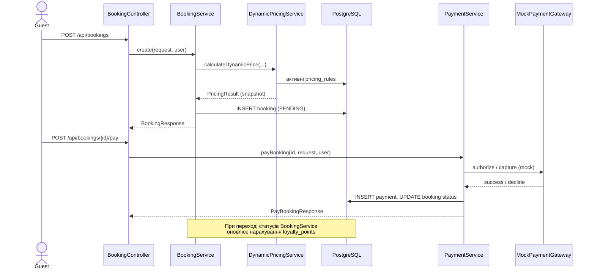

# Послідовність: бронювання → ціна → оплата → лояльність

```mermaid
sequenceDiagram
    actor G as Guest
    participant API as BookingController
    participant BS as BookingService
    participant DP as DynamicPricingService
    participant DB as PostgreSQL
    participant PS as PaymentService
    participant GW as MockPaymentGateway

    G->>API: POST /api/bookings
    API->>BS: create(request, user)
    BS->>DP: calculateDynamicPrice(...)
    DP->>DB: активні pricing_rules
    DP-->>BS: PricingResult (snapshot)
    BS->>DB: INSERT booking (PENDING)
    BS-->>API: BookingResponse

    G->>API: POST /api/bookings/{id}/pay
    API->>PS: payBooking(id, request, user)
    PS->>GW: authorize / capture (mock)
    GW-->>PS: success / decline
    PS->>DB: INSERT payment, UPDATE booking status
    PS-->>API: PayBookingResponse

    Note over BS,DB: При переході статусів BookingService<br/>оновлює нарахування loyalty_points
```
